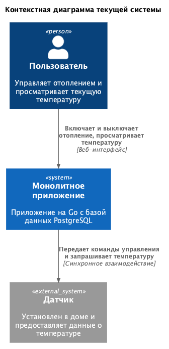

# Warmhouse

# Задание 1. Анализ и планирование

### 1. Описание функциональности монолитного приложения

**Управление отоплением:**

- Пользователи могут удаленно включать и выключать отопление в своих домах.
- Система поддерживает синхронную передачу команд управления от сервера к датчику.

**Мониторинг температуры:**

- Пользователи могут просматривать текущую температуру в своих домах через веб-интерфейс.
- Система поддерживает получение данных о температуре с установленных в домах датчиков.
- Система синхронно запрашивает актуальное значение температуры у датчика.

### 2. Анализ архитектуры монолитного приложения

- Язык программирования: Go.
- База данных: PostgreSQL.
- Архитектура: монолитная. Обработка запросов, бизнес-логика и работа с данными находятся в рамках одного приложения.
- Взаимодействие: синхронное. Запросы обрабатываются последовательно.
- Масштабируемость: ограничена, так как отдельные части монолита нельзя масштабировать независимо друг от друга.
- Развертывание: требует остановки всего приложения.

### 3. Определение доменов и границы контекстов

**Управление устройствами**

- Отвечает за удаленное включение и выключение отопления.
- Передает команды управления от сервера к датчику.
- Не отвечает за получение показаний датчиков и подключение нового оборудования.

**Мониторинг**

- Отвечает за получение данных о температуре с датчиков.
- Предоставляет пользователю текущие показания через веб-интерфейс.
- Не отвечает за управление устройствами и их подключение к системе.

**Подключение оборудования**

- Подключение системы отопления выполняет специалист компании во время выезда.
- Пользователь не может самостоятельно подключить свой датчик.

### **4. Проблемы монолитного решения**

- Нельзя отдельно масштабировать компоненты приложения.
- Развертывание требует полной остановки системы.
- Синхронная обработка ограничивает работу при росте нагрузки.
- Подключение каждого нового дома требует выезда специалиста.

### 5. Визуализация контекста системы - диаграмма С4



[Исходный код диаграммы](schemas/current-system-context.puml)

# Задание 2. Проектирование микросервисной архитектуры

В этом задании вам нужно предоставить только диаграммы в модели C4. Мы не просим вас отдельно описывать получившиеся микросервисы и то, как вы определили взаимодействия между компонентами To-Be системы. Если вы правильно подготовите диаграммы C4, они и так это покажут.

**Диаграмма контейнеров (Containers)**

Добавьте диаграмму.

**Диаграмма компонентов (Components)**

Добавьте диаграмму для каждого из выделенных микросервисов.

**Диаграмма кода (Code)**

Добавьте одну диаграмму или несколько.

# Задание 3. Разработка ER-диаграммы

Добавьте сюда ER-диаграмму. Она должна отражать ключевые сущности системы, их атрибуты и тип связей между ними.

# Задание 4. Создание и документирование API

### 1. Тип API

Укажите, какой тип API вы будете использовать для взаимодействия микросервисов. Объясните своё решение.

### 2. Документация API

Здесь приложите ссылки на документацию API для микросервисов, которые вы спроектировали в первой части проектной работы. Для документирования используйте Swagger/OpenAPI или AsyncAPI.

# Задание 5. Работа с docker и docker-compose

Перейдите в apps.

Там находится приложение-монолит для работы с датчиками температуры. В README.md описано как запустить решение.

Вам нужно:

1) сделать простое приложение temperature-api на любом удобном для вас языке программирования, которое при запросе /temperature?location= будет отдавать рандомное значение температуры.

Locations - название комнаты, sensorId - идентификатор названия комнаты

```
	// If no location is provided, use a default based on sensor ID
	if location == "" {
		switch sensorID {
		case "1":
			location = "Living Room"
		case "2":
			location = "Bedroom"
		case "3":
			location = "Kitchen"
		default:
			location = "Unknown"
		}
	}

	// If no sensor ID is provided, generate one based on location
	if sensorID == "" {
		switch location {
		case "Living Room":
			sensorID = "1"
		case "Bedroom":
			sensorID = "2"
		case "Kitchen":
			sensorID = "3"
		default:
			sensorID = "0"
		}
	}
```

2) Приложение следует упаковать в Docker и добавить в docker-compose. Порт по умолчанию должен быть 8081

3) Кроме того для smart_home приложения требуется база данных - добавьте в docker-compose файл настройки для запуска postgres с указанием скрипта инициализации ./smart_home/init.sql

Для проверки можно использовать Postman коллекцию smarthome-api.postman_collection.json и вызвать:

- Create Sensor
- Get All Sensors

Должно при каждом вызове отображаться разное значение температуры

Ревьюер будет проверять точно так же.


# **Задание 6. Разработка MVP**

Необходимо создать новые микросервисы и обеспечить их интеграции с существующим монолитом для плавного перехода к микросервисной архитектуре. 

### **Что нужно сделать**

1. Создайте новые микросервисы для управления телеметрией и устройствами (с простейшей логикой), которые будут интегрированы с существующим монолитным приложением. Каждый микросервис на своем ООП языке.
2. Обеспечьте взаимодействие между микросервисами и монолитом (при желании с помощью брокера сообщений), чтобы постепенно перенести функциональность из монолита в микросервисы. 

В результате у вас должны быть созданы Dockerfiles и docker-compose для запуска микросервисов. 